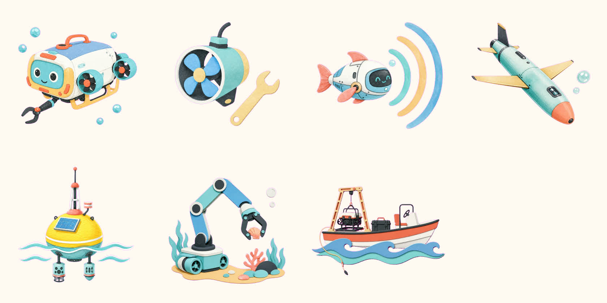

# ZJUOC Tweet Creation

浙江大学学生海洋机器人协会的 AI 原生微信公众号内容工作流。仓库可直接作为 Codex Marketplace 安装，包含 Ardot 原生排版、可检索水机素材库、微信安全 HTML 编译、浏览器导入桥接和可选的公众号草稿 MCP。



## 能做什么

- AI 先查询组件和素材注册表，再决定是否生成新图。
- 按招新、活动、科普、项目进展自动选择一套主视觉风格。
- 在 Ardot 中保留原生文本、图片填充、变量和可复用组件。
- 输出手机预览版 `index.html` 和可粘贴到公众号编辑器的 `wechat.html`。
- 自动检查深蓝违规、透明 PNG、缺失素材、滑动图库和组件 ID。
- 可选连接微信公众号 API，只创建草稿；正式发布仍需单独确认。

## 快速安装

需要安装 [Codex](https://openai.com/codex/) 和 Git。

```bash
codex plugin marketplace add ZJUOC/ZJUOC-Tweet-Creation --ref main
codex plugin add ocean-robot-wechat@zjuoc
```

安装后新建一个 Codex 任务，例如：

```text
使用 ocean-robot-wechat，把我提供的文字和照片制作成一篇招新推文。
先选素材和主风格，在 Ardot 中做原生稿，再输出并检查微信 HTML。
```

插件已声明 Ardot Remote MCP。若当前 Codex 环境没有自动出现 Ardot 工具，可手动添加并登录：

```bash
codex mcp add ardot-remote --url https://ardot.tencent.com/mcp
codex mcp login ardot-remote
```

## 本地开发与验证

```bash
git clone https://github.com/ZJUOC/ZJUOC-Tweet-Creation.git
cd ZJUOC-Tweet-Creation
./scripts/bootstrap.sh
./scripts/check.sh
./scripts/preview.sh
```

`preview.sh` 会启动本地静态服务器，打开素材库和示例推文即可检查移动端效果。

## 完整工作流

```text
用户文字/照片/事实
        ↓
组件检索 + 素材检索 + 主风格路由
        ↓
Ardot 原生稿：结构、文本、图像填充、组件实例
        ↓
article.json → 确定性编译
        ↓
index.html + wechat.html + compile-report.json
        ↓
视觉复核 + 自动检查
        ↓
编辑器导入或微信公众号草稿
```

详细说明见 [工作流](docs/WORKFLOW.md)、[素材库](docs/ASSET-LIBRARY.md) 和 [Ardot 规范](docs/ARDOT.md)。

## 素材库

当前首批注册 19 个素材：

- 5 个水彩真透明切图：ROV、推进器工具、声呐机器鱼、水下滑翔机、智能浮标。
- 2 个纸雕真透明切图：机械臂取样、外场测试船。
- 6 个原生 SVG 技术线稿。
- 6 个原生 SVG 编辑装饰。

素材不靠文件名猜测，AI 通过 `references/assets.json` 中的稳定 ID、题材、用途和风格检索。透明切图必须拥有真实 Alpha 通道，禁止把棋盘格烘焙进图片。

## 公众号草稿 MCP（可选）

草稿功能需要 Python 3.12、[uv](https://docs.astral.sh/uv/) 和公众号开发凭据。复制示例配置，但不要提交真实密钥：

```bash
cp plugins/ocean-robot-wechat/mcp/wechat-publisher-mcp/.env.example \
  plugins/ocean-robot-wechat/.env
```

填写 `MCP_BEARER_TOKEN`、`WECHAT_APP_ID`、`WECHAT_APP_SECRET` 后运行：

```bash
plugins/ocean-robot-wechat/scripts/launch-wechat-publisher-mcp
```

`MCP_ALLOW_PUBLISH=false` 是默认值。工作流可以创建草稿，但不会在没有单独确认的情况下正式群发。

## 仓库结构

```text
.agents/plugins/marketplace.json          Codex Marketplace
plugins/ocean-robot-wechat/               可安装插件
  skills/ocean-robot-wechat/              AI 工作流、素材、编译器与测试
  mcp/wechat-publisher-mcp/                可选草稿发布服务
  assets/chrome-extension/                 公众号编辑器导入桥接
examples/recruitment-2026-lively/          完整示例推文
examples/asset-library/                    素材检索预览
docs/                                      维护文档
scripts/                                   安装、预览和验证入口
```

## 安全边界

- 不要提交 `.env`、AppSecret、Bearer Token、公众号访问令牌或 `state.db`。
- 协会 Logo 只使用仓库内的原图，不用生成式模型重绘。
- 深蓝只允许存在于受保护 Logo 和用户提供的原始照片中。
- 二维码只能使用用户提供的真实素材，不生成、不替换。
- 新闻、奖项、参数和时间等事实必须来自用户材料或可核验来源。

贡献新素材或组件前请阅读 [CONTRIBUTING.md](CONTRIBUTING.md)。
